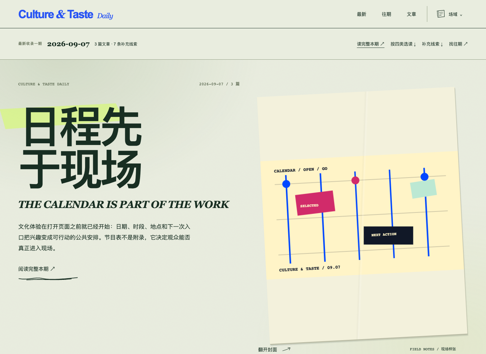
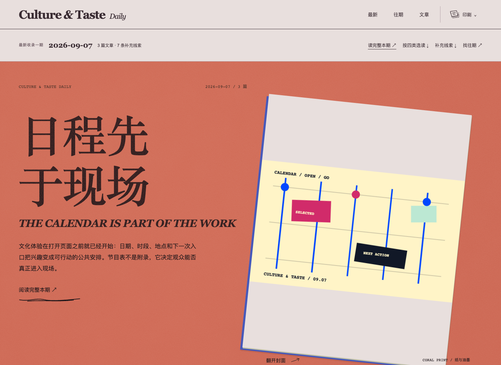
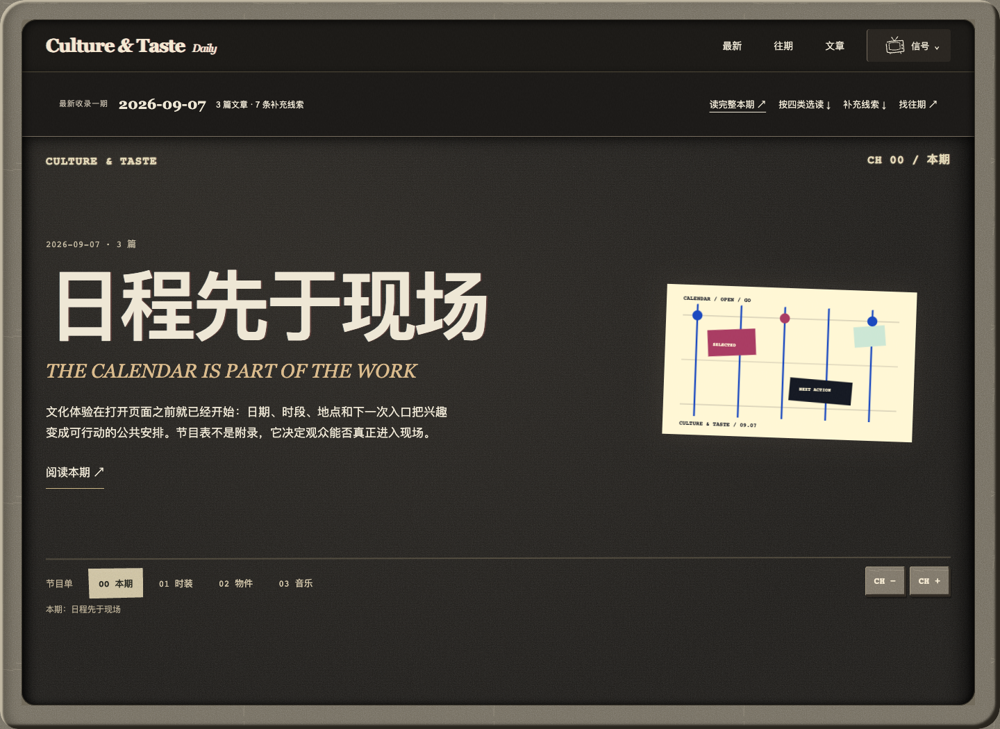

# Culture & Taste Daily

**从衣服、声音、物件与城市，读懂文化正在怎样发生。**

一本持续更新的中英双语数字文化杂志，也是一场 AI 编辑与数字出版实验。从具体作品与事件出发，读材料、读方法，也读它们与公众的关系。

*A daily bilingual magazine exploring how culture takes shape through fashion, music, objects and cities.*

**[进入杂志 ↗](https://guaizzz.github.io/culture-taste-daily/)** · [浏览往期](https://guaizzz.github.io/culture-taste-daily/archive/) · [翻阅旧版](https://guaizzz.github.io/culture-taste-daily/history/)

| 场域 · Field Notes | 印刷 · Coral Print | 信号 · Analog Signal |
|---|---|---|
|  |  |  |

**同一本杂志，三种阅读房间。** 选择纸面的边注、朱红的印刷，或旧电视里的频道。从封面到正文，保持完整的阅读气氛；图片默认原色。

你会读到 **Fashion / Music / Objects / City**：品牌与衣服的设计语言，唱片与现场形成的公众，物件进入生活的方法，以及展览和城市空间改变参与的方式。

**每篇都有判断，也留有依据。** 中文展开完整论述，英文提供标题与摘要。沿着文章里的官方发布、原始材料和来源链接，可以继续核对、继续探索。已经确认的事实，与尚待观察的影响，分开说清楚。

**让今天的选读，成为以后值得翻回的档案。** 期刊保留自己的封面、编辑顺序与原版陈列；读者可以按日期、分类或关键词重新找到内容。网站会变化，旧版本也留在 [GitHub 历史版本](https://github.com/GUAiZzz/culture-taste-daily/releases/tag/site-v1-before-rooms) 中。

从 [制作条件被看见](https://guaizzz.github.io/culture-taste-daily/issues/2026-09-04/) 开始，或直接打开 [最新一期](https://guaizzz.github.io/culture-taste-daily/)。

---

*当前开放 Preview 阅读。上图为本站原创封面的实际页面；文中引用作品与图片归各自权利人所有。*
