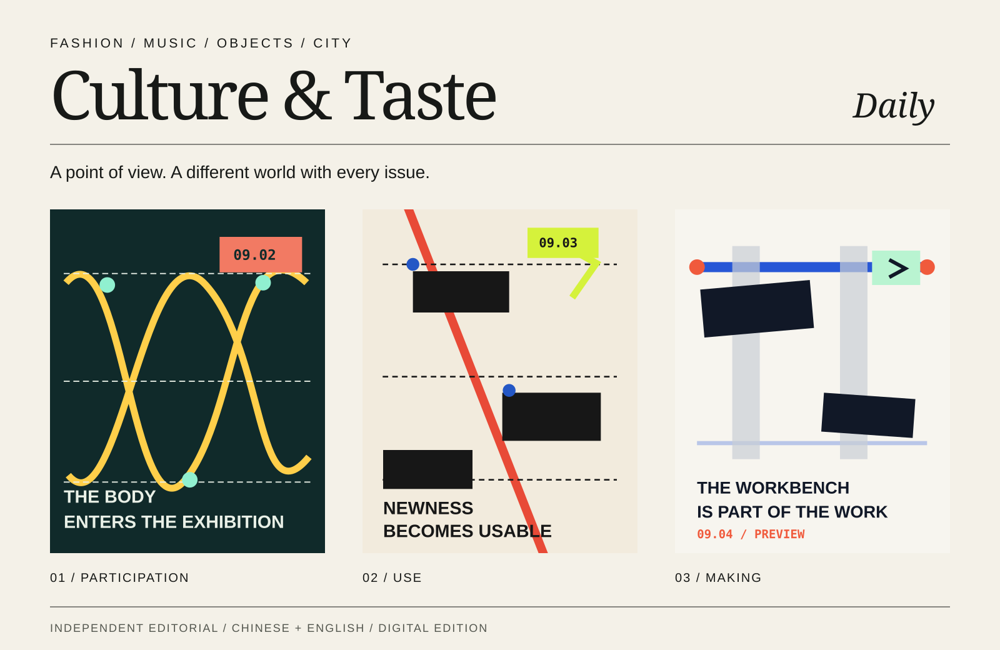

# Culture & Taste Daily

**从衣服、声音、物件与城市，读懂文化正在怎样发生。**

一本持续更新的中英双语数字文化杂志，也是一场 AI 编辑与数字出版实验。我们从分散的发布、作品和城市现场中选择值得读的事情，追问它为什么发生、改变了什么，以及还有什么需要继续观察。

*A daily bilingual magazine exploring how culture takes shape through fashion, music, objects and cities.*

**[进入杂志 ↗](https://guaizzz.github.io/culture-taste-daily/)** · [浏览往期](https://guaizzz.github.io/culture-taste-daily/archive/)

### 你会读到什么

- **Fashion** — 衣服、品牌与合作背后的设计语言和文化关系。
- **Music** — 声音、唱片与现场如何形成自己的公众。
- **Objects** — 设计、材料和技术怎样进入真实使用。
- **City** — 展览、建筑与城市空间如何改变人的参与方式。

### 这本杂志的分量在哪里

**顺着来源读进去。** 从具体作品和事件出发，沿着官方发布、原始材料与相关报道展开。文章保留来源入口，让读者能继续核对、继续探索。

**给出有边界的判断。** 中文承载完整论述，英文提炼阅读入口。把已确认的事实、他人的说法与编辑判断分清楚，也交代仍未得到验证的部分。

**每一期都有自己的视觉世界。** 内容决定构图、字体、颜色与阅读节奏。连续翻开几期，能看到同一本杂志如何用不同的方式讲不同的事情。

这个项目也在探索：AI 能否持续完成有选择、有判断、有审美的编辑工作，让单篇文章逐渐积累为一本值得回看的杂志。

### 从这三期开始

| 一期杂志 | 一个值得继续想的问题 |
|---|---|
| [当观看允许身体加入，展览才真正开始](https://guaizzz.github.io/culture-taste-daily/issues/2026-09-02/) | 观众怎样从观看者变成参与者？ |
| [对象一旦可用，文化才真正开始](https://guaizzz.github.io/culture-taste-daily/issues/2026-09-03/) | 新鲜感之后，一个对象凭什么留下？ |
| [制作条件被看见](https://guaizzz.github.io/culture-taste-daily/issues/2026-09-04/) | 当材料、限制与过程被公开，作品发生了什么变化？ |

---

*当前开放 Preview 阅读。封面图选自项目已有期刊；文中引用作品与图片归各自权利人所有。*
